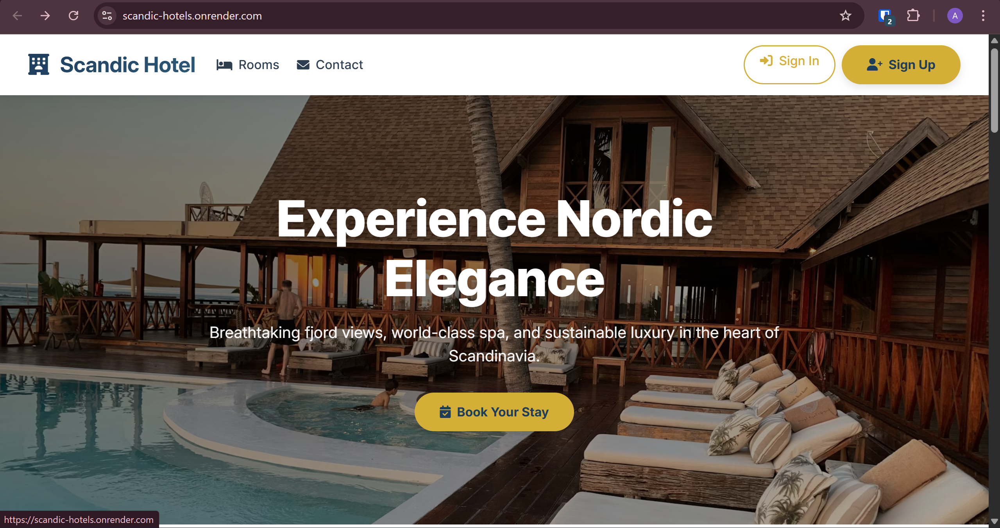
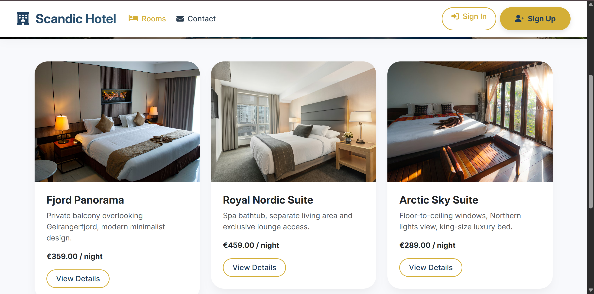
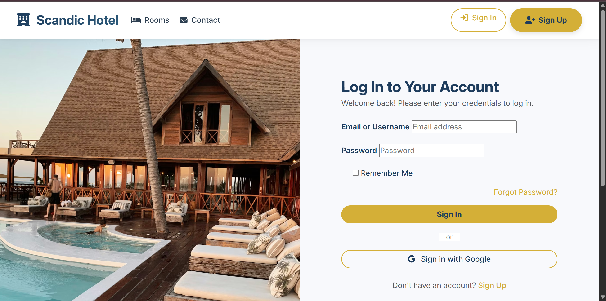

# 🏨 Scandic Hotel Booking System

A modern full-stack luxury hotel reservation platform built with **Django**, **PostgreSQL**, **Stripe**, and **Google OAuth Authentication**.

Users can browse luxury rooms, securely make reservations, complete online payments, and manage bookings through a modern responsive interface.

---

# ✨ Features

## 👤 User Features

- Google OAuth Authentication
- User Registration & Login
- Luxury Room Listings
- Room Detail Pages
- Reservation Booking System
- Stripe Payment Integration
- Reservation Success Confirmation
- User Profile Dashboard
- Booking History
- Membership Tier System
- Discount Code Support
- Contact Form Email Support

---

## 🔐 Admin Features

- Django Admin Dashboard
- Room Management
- Reservation Management
- Discount Code Management
- Amenity Management
- User Management
- Social Authentication Management

---

# 🛠️ Tech Stack

## Backend

- Python
- Django
- Django Allauth
- PostgreSQL
- Stripe API

## Frontend

- HTML5
- CSS3
- Bootstrap
- JavaScript

## Authentication

- Django Authentication
- Google OAuth

## Deployment

- Render
- Gunicorn
- WhiteNoise

---

# 📂 Project Structure

```bash
ScandicHotel/
│
├── base/
│   ├── migrations/
│   ├── templates/
│   ├── static/
│   ├── admin.py
│   ├── forms.py
│   ├── models.py
│   ├── urls.py
│   └── views.py
│
├── ScandicHotel/
│   ├── settings.py
│   ├── urls.py
│   ├── wsgi.py
│   └── asgi.py
│
├── manage.py
├── requirements.txt
└── README.md
```

---

# 🚀 Installation

## 1️⃣ Clone Repository

```bash
git clone https://github.com/yourusername/scandic-hotel-booking.git
cd scandic-hotel-booking
```

---

## 2️⃣ Create Virtual Environment

### Windows

```bash
python -m venv venv
venv\Scripts\activate
```

### Linux / macOS

```bash
python3 -m venv venv
source venv/bin/activate
```

---

## 3️⃣ Install Dependencies

```bash
pip install -r requirements.txt
```

---

# 🔑 Environment Variables

Create a `.env` file in the root directory.

```env
SECRET_KEY=your_django_secret_key

DEBUG=True

STRIPE_PUBLIC_KEY=your_stripe_public_key
STRIPE_SECRET_KEY=your_stripe_secret_key

EMAIL_HOST=smtp.sendgrid.net
EMAIL_PORT=587
EMAIL_HOST_USER=apikey
EMAIL_HOST_PASSWORD=your_sendgrid_api_key
EMAIL_USE_TLS=True

DEFAULT_FROM_EMAIL=scandichotelnoreply@gmail.com

GOOGLE_CLIENT_ID=your_google_client_id
GOOGLE_SECRET=your_google_secret

DATABASE_URL=your_postgresql_database_url
```

---

# 🗄️ Database Setup

## Run Migrations

```bash
python manage.py migrate
```

---

## Create Superuser

```bash
python manage.py createsuperuser
```

---

## Start Development Server

```bash
python manage.py runserver
```

Application will run on:

```bash
http://127.0.0.1:8000/
```

---

# 🔐 Google OAuth Setup

## Configure OAuth Credentials

1. Open Google Cloud Console
2. Create OAuth Credentials
3. Add authorised redirect URI

### Local Development

```bash
http://127.0.0.1:8000/accounts/google/login/callback/
```

### Production

```bash
https://yourdomain.com/accounts/google/login/callback/
```

---

# ⚙️ Django Admin Configuration

Go to:

```bash
/admin
```

---

## Sites Configuration

Set domain to:

### Local Development

```bash
127.0.0.1:8000
```

### Production

```bash
yourdomain.com
```

---

## Social Applications Configuration

Create a Google Social Application:

| Field | Value |
|---|---|
| Provider | Google |
| Client ID | Google OAuth Client ID |
| Secret Key | Google OAuth Secret |
| Sites | Attach Current Site |

---

# 💳 Stripe Setup

## Stripe Test Card

### Successful Payment

```bash
4242 4242 4242 4242
```

| Field | Value |
|---|---|
| Expiry | Any future date |
| CVC | Any 3 digits |
| ZIP | Any valid ZIP |

---

# 🌍 Deployment (Render)

## Build Command

```bash
pip install -r requirements.txt && python manage.py collectstatic --noinput && python manage.py migrate
```

---

## Start Command

```bash
gunicorn ScandicHotel.wsgi
```

---

# 📦 Static Files

Static files are served using WhiteNoise.

```python
STATIC_ROOT = BASE_DIR / "staticfiles"
```

---

# 🔄 Reservation Flow

```text
User Login
    ↓
Select Room
    ↓
Fill Reservation Form
    ↓
Stripe Checkout
    ↓
Payment Successful
    ↓
Reservation Saved
    ↓
Success Confirmation Page
```

---

# 🧱 Models Overview

## 🛏️ Room

Stores:
- Room name
- Price
- Images
- Description
- Amenities

---

## 📅 Reservation

Stores:
- Guest information
- Check-in / Check-out dates
- Payment method
- Reservation status
- Total price

---

## 🎁 DiscountCode

Stores:
- Discount code
- Discount type
- Percentage / fixed amount
- Active status

---

## 🧰 Amenity

Stores room amenities and features.

---

# 🔒 Security Features

- CSRF Protection
- Secure Stripe Checkout
- Environment Variable Protection
- Login Required Reservations
- Google OAuth Authentication

---

# 📈 Future Improvements

- Reservation Cancellation
- Room Availability Calendar
- Email Confirmation System
- Admin Analytics Dashboard
- Real-Time Booking Updates
- Mobile App
- Multi-language Support

---

# 📸 Screenshots

## Homepage

```markdown

```

## Room Detail

```markdown

```

## Sign in page
```markdown

```

## Contact Page
```markdown
![Contact Page](screenshots/ContactPage.png"
```


# 👥 Contributors

- Abiodun Akinrinola
- Andrew Okeke
- Meseret Abza
- Viet Anh Nguyen
- Famuyiwa Oluwatimilehin

---

# 📄 License

This project is for educational and portfolio purposes.

---

# 🙏 Acknowledgements

- Django
- Stripe
- Render
- Bootstrap
- Django Allauth
- Google OAuth
- Twilio SendGrid
